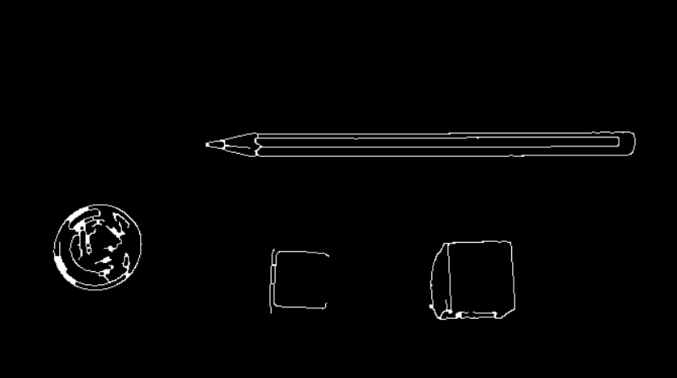
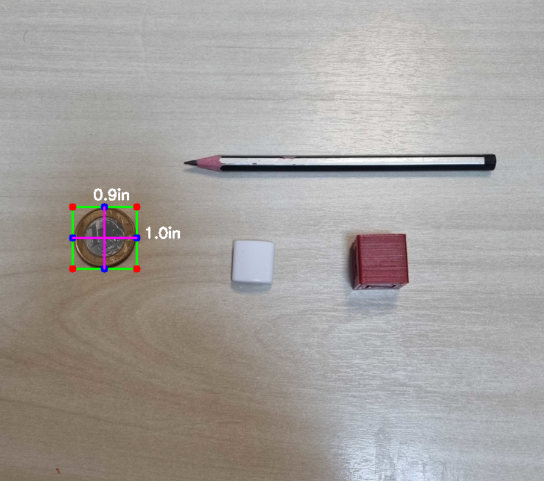
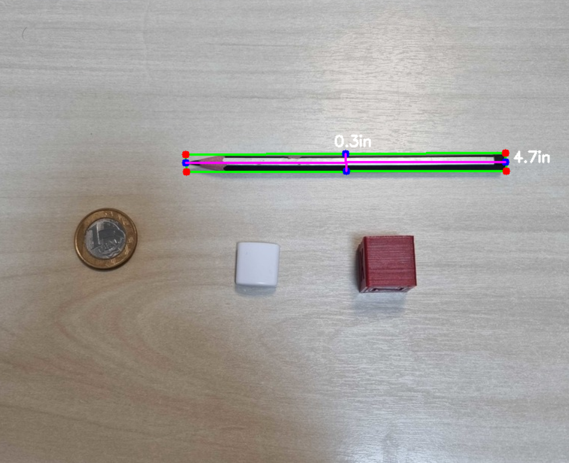

# OpenCV-2D-Object-Size

This project utilizes OpenCV to apply image filters and draw a bounding box around an object to measure its size. The goal is to use the number of pixels between the bounding box's edges to calculate the real-world size of the object. This is done by first identifying a marker of known size in the image (such as a coin) and using that measurement to scale the number of pixels in the bounding box to the object's actual size. The project involves using OpenCV's image processing capabilities to apply filters, detect edges, and draw the bounding box around the object of interest. Additionally, it involves using basic mathematical calculations to convert pixel measurements to real-world units.

 

 

 